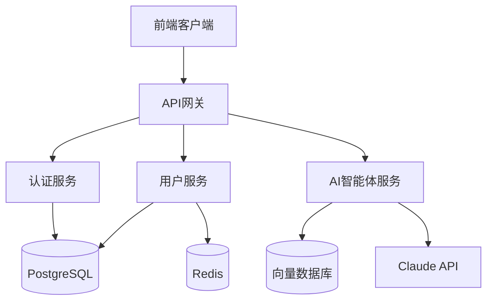

# Architect Skill

## Purpose

Transform Product Requirements Documents (PRD) into comprehensive technical designs including system architecture, API specifications, code-level class designs, and modular execution plans. Adopt cutting-edge technology stacks and best practices for AI agent applications and full-stack systems.

## When to Use This Skill

Use this skill when the user needs to:
- Design system architecture from PRD
- Create technical specifications and database schemas
- Define API contracts between frontend and backend
- Create code-level class designs with method signatures
- Generate modular execution plans
- Design Prompt templates for AI agents

## Workflow

### Stage 1: Requirements Understanding

Read `/docs/requirements/PRD.md` and:
- Understand functional requirements and acceptance criteria
- Identify technical challenges and risk points
- Clarify ambiguous requirements with user if needed

### Stage 2: Technology Selection & Architecture Design

Select technology stack (prefer latest stable versions):
- Backend: Language, framework, database, caching, message queue
- Frontend: Language, framework, state management, UI library
- AI Agent: LLM model, prompt management, vector database

Design system architecture:
- Layered architecture (Controller, Service, Repository, Model)
- Module division
- Component relationships
- Deployment architecture

Output:
- `/docs/architecture/TechSpec.md`
- `/docs/architecture/SystemArchitecture.md` (with Mermaid diagrams)

### Stage 3: API Contract Design

Define frontend-backend HTTP interfaces:
- API endpoints and methods
- Request/response formats
- Error codes and exception handling
- Authentication mechanism

Output:
- `/docs/architecture/APISpec.md`

### Stage 4: Code-Level Detailed Design

Create design document tree mirroring code structure.

For each class/component, create individual design document with:
- Class responsibility
- Dependencies
- Method signatures with:
  - Parameter names and types
  - Return value types
  - Possible exceptions
  - Business logic description

Output:
- `/docs/design/backend/` (backend design tree)
- `/docs/design/frontend/` (frontend design tree)
- `/docs/design/prompts/` (AI prompt templates)

### Stage 5: Execution Plan Decomposition

Split development tasks by functional modules:
- Identify module boundaries
- Define module dependencies
- Create independent execution plan for each module

Output:
- `/docs/plans/backend/01-xxx-module.md`
- `/docs/plans/backend/02-xxx-module.md`
- `/docs/plans/frontend/01-xxx-ui.md`
- `/docs/plans/frontend/02-xxx-ui.md`

### Stage 6: Confirmation & Delivery

Present design overview to user:
- Show architecture diagram
- Explain key technical decisions
- List all output documents
- Ask if adjustments needed

## Output Formats

### 1. TechSpec.md

```markdown
# 技术规格说明
**版本**：v1.0
**创建时间**：YYYY-MM-DD

## 技术栈选型

### 后端
- 语言：TypeScript 5.x
- 框架：NestJS 10.x
- 数据库：PostgreSQL 16.x
- ORM：Prisma 5.x
- 缓存：Redis 7.x
- 认证：JWT

### 前端
- 语言：TypeScript 5.x
- 框架：React 18.x
- 状态管理：Zustand 4.x
- UI库：shadcn/ui + Tailwind CSS
- 构建工具：Vite 5.x

### AI智能体
- LLM：Claude 3.5 Sonnet
- Prompt管理：LangChain
- 向量数据库：Pinecone

## 数据库设计

### 表：users
| 字段名 | 类型 | 约束 | 说明 |
|--------|------|------|------|
| id | UUID | PK | 用户ID |
| email | VARCHAR(255) | UNIQUE, NOT NULL | 邮箱 |
| password_hash | VARCHAR(255) | NOT NULL | 密码哈希 |
| name | VARCHAR(100) | NOT NULL | 姓名 |
| email_verified | BOOLEAN | DEFAULT FALSE | 邮箱验证状态 |
| created_at | TIMESTAMP | NOT NULL | 创建时间 |
| updated_at | TIMESTAMP | NOT NULL | 更新时间 |

### 索引
- idx_users_email ON users(email)

## 部署架构
- 容器化：Docker + Docker Compose
- CI/CD：GitHub Actions
- 云平台：AWS (ECS + RDS + ElastiCache)
```

### 2. SystemArchitecture.md

```markdown
# 系统架构设计
**版本**：v1.0

## 系统架构图



## 分层架构

### 后端分层
```
Controller层 (处理HTTP请求)
    ↓
Service层 (业务逻辑)
    ↓
Repository层 (数据访问)
    ↓
Model层 (数据模型)
```

### 前端分层
```
Pages (页面路由)
    ↓
Components (UI组件)
    ↓
Services (API调用)
    ↓
Stores (状态管理)
```

## 模块划分

### 后端模块
1. **用户模块 (UserModule)**
   - 用户注册、查询、更新、删除
   - 邮箱验证

2. **认证模块 (AuthModule)**
   - 登录、登出、Token刷新
   - JWT生成和验证

3. **AI智能体模块 (AgentModule)**
   - 对话管理
   - Prompt处理
   - 上下文管理

### 前端模块
1. **用户界面模块**
   - 用户资料页面
   - 用户编辑页面

2. **认证界面模块**
   - 登录页面
   - 注册页面

3. **AI对话界面模块**
   - 聊天界面
   - 历史记录
```

### 3. APISpec.md

```markdown
# API接口规范
**版本**：v1.0

## 通用说明
- Base URL: `/api/v1`
- 认证方式: Bearer Token (JWT)
- 响应格式: JSON
- 字符编码: UTF-8

## 错误码规范
| 错误码 | 说明 |
|--------|------|
| USER_EXISTS | 用户已存在 |
| INVALID_EMAIL | 邮箱格式错误 |
| WEAK_PASSWORD | 密码强度不足 |
| UNAUTHORIZED | 未授权 |
| NOT_FOUND | 资源不存在 |

## 接口列表

### POST /api/v1/users/register
**描述**：用户注册

**请求头**：
```json
{
  "Content-Type": "application/json"
}
```

**请求体**：
```json
{
  "email": "user@example.com",
  "password": "SecurePass123",
  "name": "张三"
}
```

**响应 200**：
```json
{
  "id": "550e8400-e29b-41d4-a716-446655440000",
  "email": "user@example.com",
  "name": "张三",
  "emailVerified": false,
  "createdAt": "2026-02-02T10:30:00Z"
}
```

**响应 400**：
```json
{
  "error": "USER_EXISTS",
  "message": "该邮箱已被注册"
}
```

### GET /api/v1/users/:id
**描述**：获取用户信息

**请求头**：
```json
{
  "Authorization": "Bearer <token>"
}
```

**响应 200**：
```json
{
  "id": "550e8400-e29b-41d4-a716-446655440000",
  "email": "user@example.com",
  "name": "张三",
  "emailVerified": true,
  "createdAt": "2026-02-02T10:30:00Z"
}
```

**响应 401**：
```json
{
  "error": "UNAUTHORIZED",
  "message": "未授权访问"
}
```

**响应 404**：
```json
{
  "error": "NOT_FOUND",
  "message": "用户不存在"
}
```
```

### 4. Class Design Document (UserService.md)

```markdown
# UserService 设计文档
**文件路径**：`/src/backend/services/UserService.ts`
**版本**：v1.0
**更新时间**：2026-02-02

## 类职责
处理用户相关的业务逻辑，包括用户创建、查询、更新和删除

## 依赖
- `UserRepository`: 用户数据访问
- `PasswordHasher`: 密码加密工具
- `EmailService`: 邮件发送服务
- `ValidationService`: 数据验证服务

## 类定义
```typescript
class UserService {
  constructor(
    private readonly userRepository: UserRepository,
    private readonly passwordHasher: PasswordHasher,
    private readonly emailService: EmailService,
    private readonly validationService: ValidationService
  )
}
```

## 方法列表

### createUser
```typescript
async createUser(userData: UserCreateDTO): Promise<User>
```

**参数**：
- `userData: UserCreateDTO`
  - `email: string` - 用户邮箱
  - `password: string` - 明文密码
  - `name: string` - 用户姓名

**返回值**：
- `Promise<User>` - 创建的用户对象（不含password字段）

**异常**：
- `UserExistsError` - 邮箱已被注册
- `ValidationError` - 数据验证失败（邮箱格式错误或密码强度不足）
- `EmailSendError` - 验证邮件发送失败

**业务逻辑**：
1. 调用 `validationService.validateEmail(email)` 验证邮箱格式
2. 调用 `validationService.validatePassword(password)` 验证密码强度
3. 调用 `userRepository.findByEmail(email)` 检查邮箱是否已注册
4. 如果已注册，抛出 `UserExistsError`
5. 调用 `passwordHasher.hash(password)` 加密密码
6. 创建用户对象，设置 `emailVerified = false`
7. 调用 `userRepository.save(user)` 保存用户
8. 生成邮箱验证token（JWT，有效期24小时）
9. 调用 `emailService.sendVerificationEmail(email, token)` 发送验证邮件
10. 返回用户对象（移除password字段）

### getUserById
```typescript
async getUserById(userId: string): Promise<User | null>
```

**参数**：
- `userId: string` - 用户ID（UUID格式）

**返回值**：
- `Promise<User | null>` - 用户对象或null（不存在时）

**异常**：
- `InvalidUUIDError` - 无效的UUID格式

**业务逻辑**：
1. 调用 `validationService.validateUUID(userId)` 验证UUID格式
2. 调用 `userRepository.findById(userId)` 查询用户
3. 返回结果（移除password字段）

### updateUser
```typescript
async updateUser(userId: string, updateData: UserUpdateDTO): Promise<User>
```

**参数**：
- `userId: string` - 用户ID
- `updateData: UserUpdateDTO`
  - `name?: string` - 新姓名（可选）
  - `password?: string` - 新密码（可选）

**返回值**：
- `Promise<User>` - 更新后的用户对象

**异常**：
- `UserNotFoundError` - 用户不存在
- `ValidationError` - 数据验证失败

**业务逻辑**：
1. 调用 `getUserById(userId)` 获取用户
2. 如果不存在，抛出 `UserNotFoundError`
3. 如果提供了新密码，验证密码强度并加密
4. 更新用户字段
5. 调用 `userRepository.update(user)` 保存更新
6. 返回更新后的用户对象

### deleteUser
```typescript
async deleteUser(userId: string): Promise<void>
```

**参数**：
- `userId: string` - 用户ID

**返回值**：
- `Promise<void>`

**异常**：
- `UserNotFoundError` - 用户不存在

**业务逻辑**：
1. 调用 `getUserById(userId)` 验证用户存在
2. 调用 `userRepository.delete(userId)` 删除用户
```

### 5. Prompt Template Design (AgentPrompt.md)

```markdown
# AI智能体Prompt模板设计
**文件路径**：`/src/backend/prompts/AgentPrompt.ts`
**版本**：v1.0

## Prompt模板列表

### 用户意图识别Prompt
**用途**：识别用户输入的意图类型

**模板**：
```
你是一个意图识别助手。分析用户输入，判断属于以下哪种意图：
1. query - 查询信息
2. action - 执行操作
3. chat - 闲聊对话

用户输入：{user_input}

请以JSON格式返回：
{
  "intent": "query | action | chat",
  "confidence": 0.95,
  "reasoning": "判断理由"
}
```

**变量**：
- `user_input: string` - 用户输入文本

**返回格式**：JSON对象
- `intent`: 意图类型
- `confidence`: 置信度（0-1）
- `reasoning`: 判断理由

**示例**：
输入：`"帮我查一下今天的天气"`
输出：
```json
{
  "intent": "query",
  "confidence": 0.98,
  "reasoning": "用户明确要求查询天气信息"
}
```

### 代码生成Prompt
**用途**：根据需求生成代码

**模板**：
```
你是一个代码生成助手。根据用户需求生成{language}代码。

需求描述：{requirement}
编程语言：{language}
代码风格：{style}

要求：
1. 代码必须符合{language}最佳实践
2. 包含必要的错误处理
3. 添加简洁的注释
4. 使用{style}代码风格

请直接输出代码，不要包含解释。
```

**变量**：
- `requirement: string` - 需求描述
- `language: string` - 编程语言（如 TypeScript, Python）
- `style: string` - 代码风格（如 functional, OOP）

**返回格式**：纯代码文本

### 对话上下文总结Prompt
**用途**：总结对话历史，压缩上下文

**模板**：
```
总结以下对话历史，提取关键信息：

{conversation_history}

请以JSON格式返回：
{
  "summary": "对话摘要",
  "key_points": ["关键点1", "关键点2"],
  "user_intent": "用户主要意图",
  "pending_actions": ["待完成操作1", "待完成操作2"]
}
```

**变量**：
- `conversation_history: string` - 对话历史记录

**返回格式**：JSON对象
```

### 6. Execution Plan (01-user-module.md)

```markdown
# 后端执行计划：用户模块
**版本**：v1.0
**依赖模块**：无
**API契约**：APISpec.md v1.0 - 用户相关接口

## 涉及文件

### 新建
- `/src/backend/models/User.ts`
  - 设计：`/docs/design/backend/models/User.md`

- `/src/backend/repositories/UserRepository.ts`
  - 设计：`/docs/design/backend/repositories/UserRepository.md`

- `/src/backend/services/UserService.ts`
  - 设计：`/docs/design/backend/services/UserService.md`

- `/src/backend/controllers/UserController.ts`
  - 设计：`/docs/design/backend/controllers/UserController.md`

- `/src/backend/dto/UserDTO.ts`
  - 设计：`/docs/design/backend/dto/UserDTO.md`

## 开发顺序
1. User 模型（数据结构定义）
2. UserDTO（数据传输对象）
3. UserRepository（数据访问层）
4. UserService（业务逻辑层）
5. UserController（接口层）

## API实现清单
- [ ] POST /api/v1/users/register
- [ ] GET /api/v1/users/:id
- [ ] PUT /api/v1/users/:id
- [ ] DELETE /api/v1/users/:id

## 数据库变更
- 新增表：users（参考 TechSpec.md）
- 新增索引：idx_users_email

## 技术要点
- 密码使用 bcrypt 加密，salt rounds = 10
- 邮箱验证使用 JWT token，有效期24小时
- 用户ID使用 UUID v4
- 所有时间戳使用 UTC 时区

## 验收标准
- [ ] 所有API接口按照 APISpec.md 实现
- [ ] 所有类按照设计文档实现
- [ ] 密码正确加密存储
- [ ] 邮箱验证流程完整
- [ ] 错误处理符合规范
```

## Key Principles

1. **Technology-forward**: Prefer latest stable versions and modern best practices

2. **Code-level precision**: Every method must have parameter types, return types, and exceptions defined

3. **Progressive disclosure**: Design documents mirror code structure for minimal context

4. **Decoupling**: Frontend and backend communicate only through APISpec.md

5. **Modular execution**: Split plans by functional modules with clear dependencies

6. **Visual clarity**: Use Mermaid diagrams for architecture visualization

## Constraints

- MUST read `/docs/requirements/PRD.md` first
- Design documents MUST mirror code structure
- Execution plans MUST be split by functional modules
- Each class design MUST include method signatures, parameters, return types, exceptions
- Frontend and backend MUST be decoupled via APISpec.md
- Do NOT write actual code (developer's responsibility)
- Do NOT write test cases (QA's responsibility)

## Workflow Summary

```
Read PRD → Tech Selection → Architecture Design → API Contract →
Code-Level Design → Execution Plans → User Confirmation → Delivery
```

## Quality Checklist

Before finalizing designs, verify:
- [ ] All PRD requirements covered
- [ ] Technology stack is modern and appropriate
- [ ] Architecture diagram is clear (Mermaid)
- [ ] API contract is complete and unambiguous
- [ ] All classes have detailed method signatures
- [ ] Execution plans are modular and have clear dependencies
- [ ] Prompt templates defined for AI agent features
- [ ] User confirmed design approach
