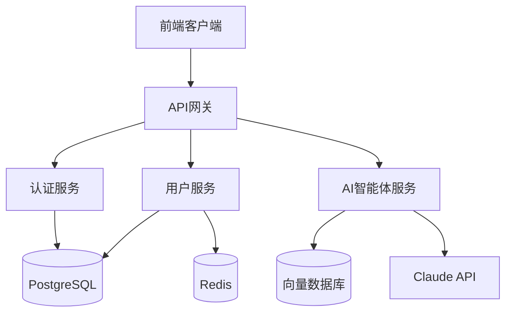

--------------------

## name：架构师描述：当用户要求"设计架构"、"创建技术设计"、"设计系统"、"创建API规范"、"设计数据库"、"创建执行计划"，或需要AI智能体应用或全栈系统的技术架构和详细设计时，应使用此技能。版本：1.0.0 ##

# 架构师技能 #

## 目的： ##

将产品需求文档（PDD）转化为全面的技术设计，包括系统架构、API规范、代码级类设计、模块化执行计划等。为AI智能体应用和全栈系统采用前沿技术栈和最佳实践。

## 何时使用此技能 ##

当用户需要以下操作时，使用此技能：

 *  从PRD设计系统架构
 *  创建技术规范和数据库模式
 *  定义前端和后端之间的API契约
 *  创建具有方法签名的代码级类设计
 *  生成模块化执行计划
 *  为AI座席设计提示模板

## 工作流程 ##

### 第一阶段：需求理解 ###

读`/docs/requirements/PRD.md`和：

 *  了解功能要求和验收标准
 *  识别技术挑战和风险点
 *  必要时与用户澄清不明确的需求

### 第二阶段：技术选型&架构设计 ###

选择技术栈（首选最新稳定版本）

 *  后端：语言、框架、数据库、缓存、消息队列
 *  前端：语言、框架、状态管理、UI库
 *  AI Agent: LLM模型，提示管理，向量数据库

系统架构设计：

 *  分层架构（控制器、服务、仓库、模型）
 *  模块划分
 *  组件关系
 *  部署架构

输出：

 *  `/docs/architecture/TechSpec.md`
 *  `/docs/architecture/SystemArchitecture.md`（有美人鱼图）

### 第三阶段：API契约设计 ###

定义前后端HTTP接口：

 *  API端点和方法
 *  请求/响应格式
 *  错误码和异常处理
 *  认证机制

输出：

 *  `/docs/architecture/APISpec.md`

### 第四阶段：代码级详细设计 ###

创建设计文档树镜像代码结构。

对于每个类/组件，使用以下工具创建单独的设计文档：

 *  班级责任
 *  依赖关系
 *  方法签名：
    
     *  参数名称和类型
     *  返回值类型
     *  可能出现的异常情况
     *  业务逻辑描述

输出：

 *  `/docs/design/backend/`（后端设计树）
 *  `/docs/design/frontend/`（前端设计树）
 *  `/docs/design/prompts/`（人工智能提示模板）

### 阶段5：执行计划分解 ###

按功能模块拆分开发任务：

 *  识别模块边界
 *  定义模块依赖关系
 *  为每个模块创建独立的执行计划

输出：

 *  `/docs/plans/backend/01-xxx-module.md`
 *  `/docs/plans/backend/02-xxx-module.md`
 *  `/docs/plans/frontend/01-xxx-ui.md`
 *  `/docs/plans/frontend/02-xxx-ui.md`

### 第六阶段：确认和交付 ###

向用户展示设计概述：

 *  显示体系结构图
 *  解释关键的技术决策
 *  列出所有输出文档
 *  询问是否需要调整

## 输出格式 ##

### 1.技术规格.md ###

```
#技术规格说明
**版本**：v1.0
**创建时间**：YYYY-MM-DD

##技术栈选型

###后端
- 语言：TypeScript 5.x
- 框架：NestJS 10.x
- 数据库：PostgreSQL 16.x
- ORM：Prisma 5.x
- 缓存：Redis 7.x
- 认证：JWT

###前端
- 语言：TypeScript 5.x
- 框架：React 18.x
- 状态管理：Zustand 4.x
- UI库：shadcn/ui + Tailwind CSS
- 构建工具：Vite 5.x

###AI智能体
- LLM：Claude 3.5 Sonnet
- Prompt管理：LangChain
- 向量数据库：Pinecone

##数据库设计

###表：用户
| 字段名 | 类型 | 约束 | 说明 |
|--------|------|------|------|
| id | UUID | PK | 用户ID |
| email | VARCHAR(255) | UNIQUE, NOT NULL | 邮箱 |
| password_hash | VARCHAR(255) | NOT NULL | 密码哈希 |
| name | VARCHAR(100) | NOT NULL | 姓名 |
| email_verified | BOOLEAN | DEFAULT FALSE | 邮箱验证状态 |
| created_at | TIMESTAMP | NOT NULL | 创建时间 |
| updated_at | TIMESTAMP | NOT NULL | 更新时间 |

###索引
- idx_users_email ON users(email)

##部署架构
- 容器化：Docker + Docker Compose
- CI/CD：GitHub Actions
- 云平台：AWS (ECS + RDS + ElastiCache)
```

### 2.系统体系结构.md ###

```
#系统架构设计
**版本**：v1.0

##系统架构图



## 分层架构 ##

### 后端分层 ###

```
Controller层 (处理HTTP请求)
    ↓
Service层 (业务逻辑)
    ↓
Repository层 (数据访问)
    ↓
Model层 (数据模型)
```

### 前端分层 ###

```
Pages (页面路由)
    ↓
Components (UI组件)
    ↓
Services (API调用)
    ↓
Stores (状态管理)
```

## 模块划分 ##

### 后端模块 ###

1.  **用户模块（用户模块）**
    
     *  用户注册、查询、更新、删除
     *  邮箱验证
2.  **认证模块（鉴权模块）**
    
     *  登录、登出、令牌刷新
     *  JWT生成和验证
3.  **AI智能体模块（Agent模块）**
    
     *  对话管理
     *  提示处理
     *  上下文管理

### 前端模块 ###

1.  **用户界面模块**
    
     *  用户资料页面
     *  用户编辑页面
2.  **认证界面模块**
    
     *  登录页面
     *  注册页面
3.  **AI对话界面模块**
    
     *  聊天界面
     *  历史记录

```
### 3. APISpec.md

```markdown
#API接口接口规范
**版本**：v1.0

##通用说明
- Base URL: `/api/v1`
- 认证方式: Bearer Token (JWT)
- 响应格式: JSON
- 字符编码: UTF-8

##错误码规范
| 错误码 | 说明 |
|--------|------|
| USER_EXISTS | 用户已存在 |
| INVALID_EMAIL | 邮箱格式错误 |
| WEAK_PASSWORD | 密码强度不足 |
| UNAUTHORIZED | 未授权 |
| NOT_FOUND | 资源不存在 |

##接口列表

### POST /api/v1/users/register
**描述**：用户注册

**请求头**：
```json
{
  "Content-Type": "application/json"
}
```

**请求体：**

```
{
  "email": "user@example.com",
  "password": "SecurePass123",
  "name": "张三"
}
```

**响应200：**

```
{
  "id": "550e8400-e29b-41d4-a716-446655440000",
  "email": "user@example.com",
  "name": "张三",
  "emailVerified": false,
  "createdAt": "2026-02-02T10:30:00Z"
}
```

**响应400：**

```
{
  "error": "USER_EXISTS",
  "message": "该邮箱已被注册"
}
```

### GET /api/v1/users/:id ###

**描述：获取用户信息**

**请求头：**

```
{
  "Authorization": "Bearer <token>"
}
```

**响应200：**

```
{
  "id": "550e8400-e29b-41d4-a716-446655440000",
  "email": "user@example.com",
  "name": "张三",
  "emailVerified": true,
  "createdAt": "2026-02-02T10:30:00Z"
}
```

**响应401：**

```
{
  "error": "UNAUTHORIZED",
  "message": "未授权访问"
}
```

**响应404：**

```
{
  "error": "NOT_FOUND",
  "message": "用户不存在"
}
```

```
### 4.类设计文档(UserService.md)

```markdown
#用户服务设计文档
**文件路径**：`/src/backend/services/UserService.ts`
**版本**：v1.0
**更新时间**：2026-02-02

##类职责
处理用户相关的业务逻辑，包括用户创建、查询、更新和删除

##依赖
- `UserRepository`: 用户数据访问
- `PasswordHasher`: 密码加密工具
- `EmailService`: 邮件发送服务
- `ValidationService`: 数据验证服务

##类定义
```typescript
class UserService {
  constructor(
    private readonly userRepository: UserRepository,
    private readonly passwordHasher: PasswordHasher,
    private readonly emailService: EmailService,
    private readonly validationService: ValidationService
  )
}
```

## 方法列表 ##

### 创建用户 ###

```
async createUser(userData: UserCreateDTO): Promise<User>
```

**参数：**

 *  `userData: UserCreateDTO`
    
     *  `email: string`\-用户邮箱
     *  `password: string`\-明文密码
     *  `name: string`\-用户姓名

**返回值：**

 *  `Promise<User>`\-创建的用户对象（不含密码字段）

**异常：**

 *  `UserExistsError`\-邮箱已被注册
 *  `ValidationError`\-数据验证失败（邮箱格式错误或密码强度不足）
 *  `EmailSendError`\-验证邮件发送失败

**业务逻辑：**

1.  调用`validationService.validateEmail(email)`验证邮箱格式
2.  调用`validationService.validatePassword(password)`验证密码强度
3.  调用`userRepository.findByEmail(email)`检查邮箱是否已注册
4.  如果已注册，抛出`UserExistsError`
5.  调用`passwordHasher.hash(password)`加密密码
6.  创建用户对象，设置`emailVerified = false`
7.  调用`userRepository.save(user)`保存用户
8.  生成邮箱验证令牌（JWT，有效期24小时）
9.  调用`emailService.sendVerificationEmail(email, token)`发送验证邮件
10. 返回用户对象（移除密码字段）

### 获取用户ID ###

```
async getUserById(userId: string): Promise<User | null>
```

**参数：**

 *  `userId: string`\-用户标识（UUID格式）

**返回值：**

 *  `Promise<User | null>`\-用户对象或空值（不存在时）

**异常：**

 *  `InvalidUUIDError`\-无效的UUID格式

**业务逻辑：**

1.  调用`validationService.validateUUID(userId)`验证UUID格式
2.  调用`userRepository.findById(userId)`查询用户
3.  返回结果（移除密码字段）

### 更新用户 ###

```
async updateUser(userId: string, updateData: UserUpdateDTO): Promise<User>
```

**参数：**

 *  `userId: string`\-用户标识
 *  `updateData: UserUpdateDTO`
    
     *  `name?: string`\-新姓名（可选）
     *  `password?: string`\-新密码（可选）

**返回值：**

 *  `Promise<User>`\-更新后的用户对象

**异常：**

 *  `UserNotFoundError`\-用户不存在
 *  `ValidationError`\-数据验证失败

**业务逻辑：**

1.  调用`getUserById(userId)`获取用户
2.  如果不存在，抛出`UserNotFoundError`
3.  如果提供了新密码，验证密码强度并加密
4.  更新用户字段
5.  调用`userRepository.update(user)`保存更新
6.  返回更新后的用户对象

### 删除用户 ###

```
async deleteUser(userId: string): Promise<void>
```

**参数：**

 *  `userId: string`\-用户标识

**返回值：**

 *  `Promise<void>`

**异常：**

 *  `UserNotFoundError`\-用户不存在

**业务逻辑：**

1.  调用`getUserById(userId)`验证用户存在
2.  调用`userRepository.delete(userId)`删除用户

```
### 5.提示模板设计(AgentPrompt.md)

```markdown
#AI智能体提示模板设计
**文件路径**：`/src/backend/prompts/AgentPrompt.ts`
**版本**：v1.0

##提示模板列表

###用户意图识别提示符
**用途**：识别用户输入的意图类型

**模板**：
```

你是一个意图识别助手。分析用户输入，判断属于以下哪种意图：

1.  查询-查询信息
2.  操作-执行操作
3.  聊天-闲聊对话

用户输入：\{user_input\}

请以JSON格式返回：\{"意图":"查询\|动作\|聊天","置信度":0.95,"推理":"判断理由"\}

```
**变量**：
- `user_input: string` - 用户输入文本

**返回格式**：JSON对象
- `intent`: 意图类型
- `confidence`: 置信度（0-1）
- `reasoning`: 判断理由

**示例**：
输入：`"帮我查一下今天的天气"`
输出：
```json
{
  "intent": "query",
  "confidence": 0.98,
  "reasoning": "用户明确要求查询天气信息"
}
```

### 代码生成提示 ###

**用途：根据需求生成代码**

**模板：**

```
你是一个代码生成助手。根据用户需求生成{language}代码。

需求描述：{requirement}
编程语言：{language}
代码风格：{style}

要求：
1. 代码必须符合{language}最佳实践
2. 包含必要的错误处理
3. 添加简洁的注释
4. 使用{style}代码风格

请直接输出代码，不要包含解释。
```

**变量：**

 *  `requirement: string`\-需求描述
 *  `language: string`\-编程语言（如TypeScript、Python）
 *  `style: string`\-代码风格（如功能，OOP）

**返回格式：纯代码文本**

### 对话上下文总结提示 ###

**用途：总结对话历史，压缩上下文**

**模板：**

```
总结以下对话历史，提取关键信息：

{conversation_history}

请以JSON格式返回：
{
  "summary": "对话摘要",
  "key_points": ["关键点1", "关键点2"],
  "user_intent": "用户主要意图",
  "pending_actions": ["待完成操作1", "待完成操作2"]
}
```

**变量：**

 *  `conversation_history: string`\-对话历史记录

**返回格式：JSON对象**

```
### 6.执行计划(01-user-module.md)

```markdown
#后端执行计划：用户模块
**版本**：v1.0
**依赖模块**：无
**API契约**：APISpec.md v1.0 - 用户相关接口

##涉及文件

###新建
- `/src/backend/models/User.ts`
  - 设计：`/docs/design/backend/models/User.md`

- `/src/backend/repositories/UserRepository.ts`
  - 设计：`/docs/design/backend/repositories/UserRepository.md`

- `/src/backend/services/UserService.ts`
  - 设计：`/docs/design/backend/services/UserService.md`

- `/src/backend/controllers/UserController.ts`
  - 设计：`/docs/design/backend/controllers/UserController.md`

- `/src/backend/dto/UserDTO.ts`
  - 设计：`/docs/design/backend/dto/UserDTO.md`

##开发顺序
1. User 模型（数据结构定义）
2. UserDTO（数据传输对象）
3. UserRepository（数据访问层）
4. UserService（业务逻辑层）
5. UserController（接口层）

##接口实现清单
- [ ] POST /api/v1/users/register
- [ ] GET /api/v1/users/:id
- [ ] PUT /api/v1/users/:id
- [ ] DELETE /api/v1/users/:id

##数据库变更
- 新增表：users（参考 TechSpec.md）
- 新增索引：idx_users_email

##技术要点
- 密码使用 bcrypt 加密，salt rounds = 10
- 邮箱验证使用 JWT token，有效期24小时
- 用户ID使用 UUID v4
- 所有时间戳使用 UTC 时区

##验收标准
- [ ] 所有API接口按照 APISpec.md 实现
- [ ] 所有类按照设计文档实现
- [ ] 密码正确加密存储
- [ ] 邮箱验证流程完整
- [ ] 错误处理符合规范
```

## 关键原理 ##

1.  **技术前沿：首选最新稳定版本和现代最佳实践**
2.  **代码级精度：每个方法都必须定义有参数类型、返回类型和异常**
3.  **渐进式公开：设计文档镜像代码结构，以减少上下文**
4.  **解耦：前后端只通过APISpec.md进行通信**
5.  **模块化执行：按功能模块拆分计划，依赖关系清晰**
6.  **视觉清晰：使用美人鱼图进行架构可视化**

## 约束条件 ##

 *  必须阅读`/docs/requirements/PRD.md`第一
 *  设计文档必须镜像代码结构
 *  执行计划必须按功能模块拆分
 *  每个类的设计必须包括方法签名、参数、返回类型、异常
 *  前端和后端必须通过APISpec.md解耦
 *  不要编写实际的代码（开发人员的责任）
 *  不要写测试用例（QA的职责）

## 工作流摘要 ##

```
Read PRD → Tech Selection → Architecture Design → API Contract →
Code-Level Design → Execution Plans → User Confirmation → Delivery
```

## 质量检查表 ##

在最终确定设计之前，请验证：

 *  【】覆盖所有PRD需求
 *  【】技术栈现代得体
 *  【】架构图清晰（美人鱼）
 *  【】API契约完整无歧义
 *  所有的类都有详细的方法签名
 *  【】执行计划是模块化的，有明确的依赖关系
 *  \[\]AI座席特性定义的提示模板
 *  【】用户确认的设计方法

