# 系统架构设计 (System Architecture)

**项目名称**: 问题定位助手 (Problem Diagnosis Assistant)
**文档版本**: 1.0
**创建日期**: 2026-02-03
**作者**: System Architect
**状态**: 待审核

---

## 1. 系统架构概览

### 1.1 整体架构

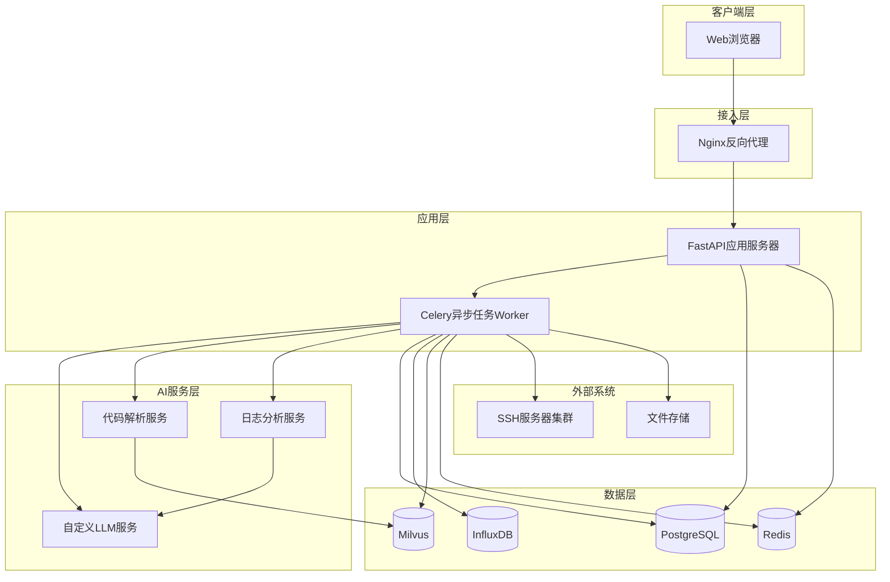
```mermaid
graph TB
    subgraph "客户端层"
        WebUI[Web浏览器]
    end

    subgraph "接入层"
        Nginx[Nginx反向代理]
    end

    subgraph "应用层"
        API[FastAPI应用服务器]
        Worker[Celery异步任务Worker]
    end

    subgraph "AI服务层"
        LLM[自定义LLM服务]
        CodeParser[代码解析服务]
        LogAnalyzer[日志分析服务]
    end

    subgraph "数据层"
        PG[(PostgreSQL)]
        Influx[(InfluxDB)]
        Milvus[(Milvus)]
        Redis[(Redis)]
    end

    subgraph "外部系统"
        SSH[SSH服务器集群]
        FileStorage[文件存储]
    end

    WebUI --> Nginx
    Nginx --> API
    API --> Worker
    API --> PG
    API --> Redis
    Worker --> LLM
    Worker --> CodeParser
    Worker --> LogAnalyzer
    Worker --> PG
    Worker --> Influx
    Worker --> Milvus
    Worker --> Redis
    Worker --> SSH
    Worker --> FileStorage
    LogAnalyzer --> LLM
    CodeParser --> Milvus
```

---

## 2. 分层架构设计

### 2.1 四层架构

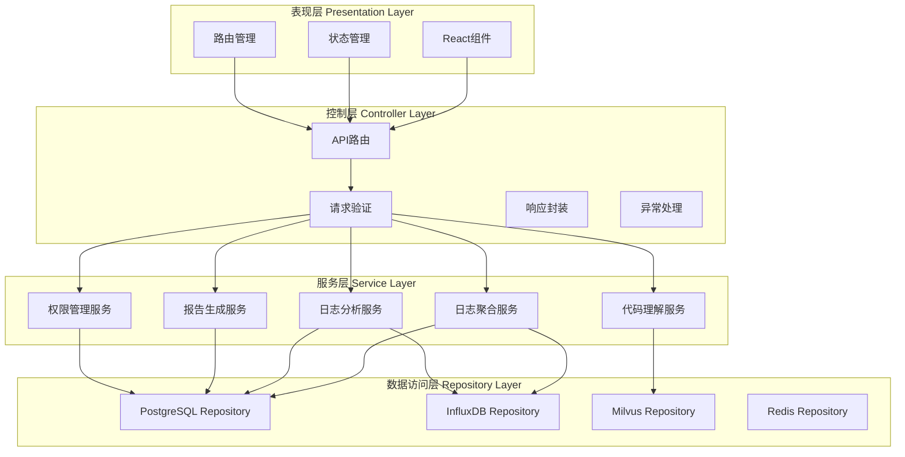
```mermaid
graph TB
    subgraph "表现层 Presentation Layer"
        P1[React组件]
        P2[状态管理]
        P3[路由管理]
    end

    subgraph "控制层 Controller Layer"
        C1[API路由]
        C2[请求验证]
        C3[响应封装]
        C4[异常处理]
    end

    subgraph "服务层 Service Layer"
        S1[日志聚合服务]
        S2[日志分析服务]
        S3[代码理解服务]
        S4[报告生成服务]
        S5[权限管理服务]
    end

    subgraph "数据访问层 Repository Layer"
        R1[PostgreSQL Repository]
        R2[InfluxDB Repository]
        R3[Milvus Repository]
        R4[Redis Repository]
    end

    P1 --> C1
    P2 --> C1
    P3 --> C1
    C1 --> C2
    C2 --> S1
    C2 --> S2
    C2 --> S3
    C2 --> S4
    C2 --> S5
    S1 --> R1
    S1 --> R2
    S2 --> R1
    S2 --> R2
    S3 --> R3
    S4 --> R1
    S5 --> R1
```

---

## 3. 核心模块设计

### 3.1 日志聚合模块

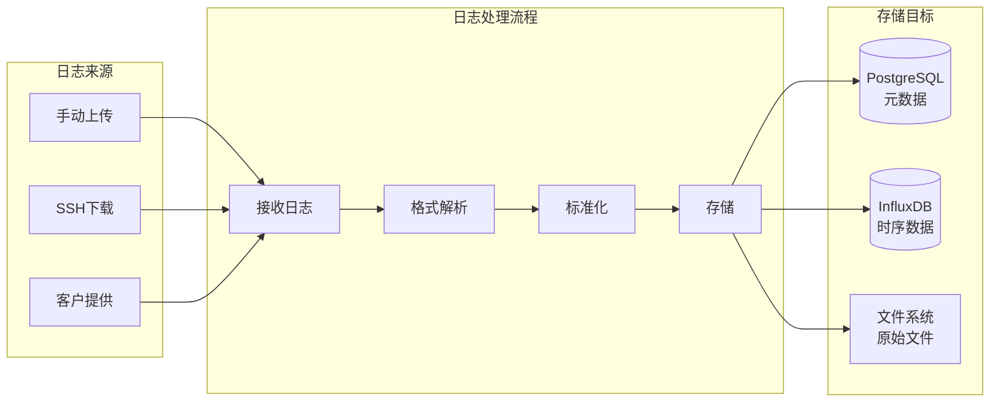
```mermaid
graph LR
    subgraph "日志来源"
        Upload[手动上传]
        SSHDownload[SSH下载]
        Customer[客户提供]
    end

    subgraph "日志处理流程"
        Receive[接收日志]
        Parse[格式解析]
        Normalize[标准化]
        Store[存储]
    end

    subgraph "存储目标"
        PG[(PostgreSQL<br/>元数据)]
        Influx[(InfluxDB<br/>时序数据)]
        File[文件系统<br/>原始文件]
    end

    Upload --> Receive
    SSHDownload --> Receive
    Customer --> Receive
    Receive --> Parse
    Parse --> Normalize
    Normalize --> Store
    Store --> PG
    Store --> Influx
    Store --> File
```

#### 日志解析流程

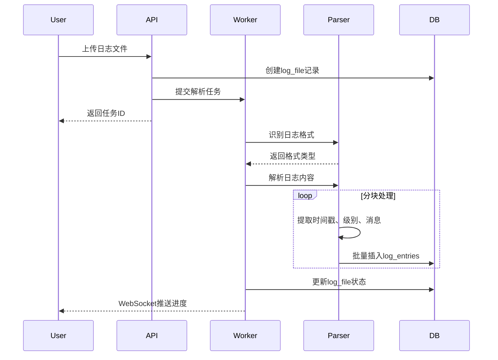
```mermaid
sequenceDiagram
    participant User
    participant API
    participant Worker
    participant Parser
    participant DB

    User->>API: 上传日志文件
    API->>DB: 创建log_file记录
    API->>Worker: 提交解析任务
    API-->>User: 返回任务ID

    Worker->>Parser: 识别日志格式
    Parser-->>Worker: 返回格式类型

    Worker->>Parser: 解析日志内容
    loop 分块处理
        Parser->>Parser: 提取时间戳、级别、消息
        Parser->>DB: 批量插入log_entries
    end

    Worker->>DB: 更新log_file状态
    Worker-->>User: WebSocket推送进度
```

---

### 3.2 智能日志分析模块

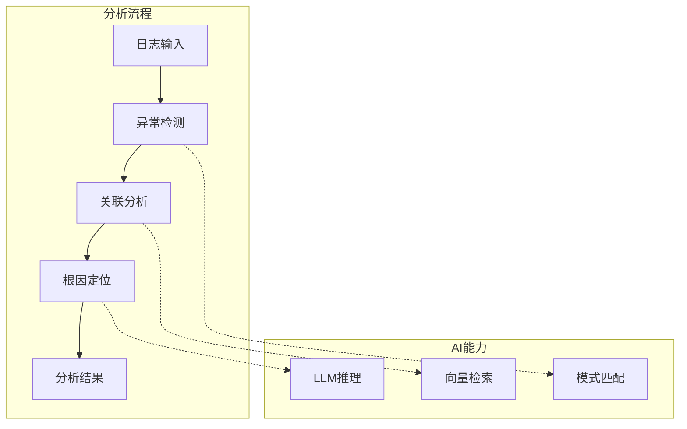
```mermaid
graph TB
    subgraph "分析流程"
        Input[日志输入]
        Detect[异常检测]
        Correlate[关联分析]
        RootCause[根因定位]
        Output[分析结果]
    end

    subgraph "AI能力"
        LLM[LLM推理]
        Vector[向量检索]
        Pattern[模式匹配]
    end

    Input --> Detect
    Detect --> Correlate
    Correlate --> RootCause
    RootCause --> Output

    Detect -.-> Pattern
    Correlate -.-> Vector
    RootCause -.-> LLM
```

#### 根因分析流程

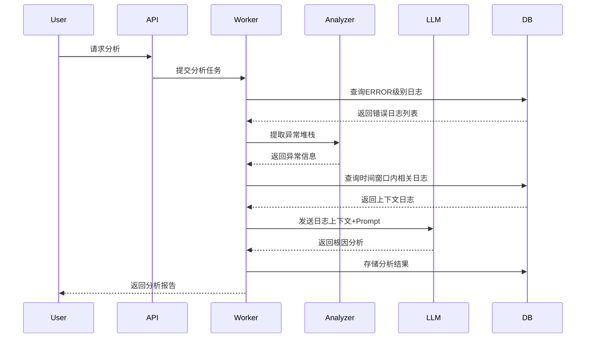
```mermaid
sequenceDiagram
    participant User
    participant API
    participant Worker
    participant Analyzer
    participant LLM
    participant DB

    User->>API: 请求分析
    API->>Worker: 提交分析任务

    Worker->>DB: 查询ERROR级别日志
    DB-->>Worker: 返回错误日志列表

    Worker->>Analyzer: 提取异常堆栈
    Analyzer-->>Worker: 返回异常信息

    Worker->>DB: 查询时间窗口内相关日志
    DB-->>Worker: 返回上下文日志

    Worker->>LLM: 发送日志上下文+Prompt
    LLM-->>Worker: 返回根因分析

    Worker->>DB: 存储分析结果
    Worker-->>User: 返回分析报告
```

---

### 3.3 代码理解模块

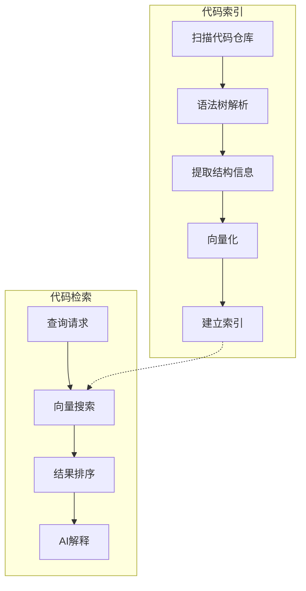
```mermaid
graph TB
    subgraph "代码索引"
        Scan[扫描代码仓库]
        Parse[语法树解析]
        Extract[提取结构信息]
        Vectorize[向量化]
        Index[建立索引]
    end

    subgraph "代码检索"
        Query[查询请求]
        Search[向量搜索]
        Rank[结果排序]
        Explain[AI解释]
    end

    Scan --> Parse
    Parse --> Extract
    Extract --> Vectorize
    Vectorize --> Index

    Query --> Search
    Search --> Rank
    Rank --> Explain

    Index -.-> Search
```

#### 代码索引流程

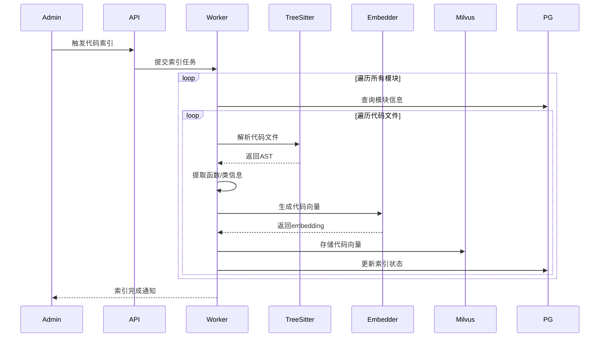
```mermaid
sequenceDiagram
    participant Admin
    participant API
    participant Worker
    participant TreeSitter
    participant Embedder
    participant Milvus
    participant PG

    Admin->>API: 触发代码索引
    API->>Worker: 提交索引任务

    loop 遍历所有模块
        Worker->>PG: 查询模块信息

        loop 遍历代码文件
            Worker->>TreeSitter: 解析代码文件
            TreeSitter-->>Worker: 返回AST

            Worker->>Worker: 提取函数/类信息
            Worker->>Embedder: 生成代码向量
            Embedder-->>Worker: 返回embedding

            Worker->>Milvus: 存储代码向量
            Worker->>PG: 更新索引状态
        end
    end

    Worker-->>Admin: 索引完成通知
```

---

### 3.4 报告生成模块

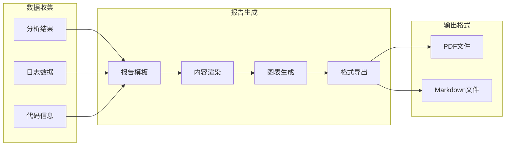
```mermaid
graph LR
    subgraph "数据收集"
        D1[分析结果]
        D2[日志数据]
        D3[代码信息]
    end

    subgraph "报告生成"
        Template[报告模板]
        Render[内容渲染]
        Chart[图表生成]
        Export[格式导出]
    end

    subgraph "输出格式"
        PDF[PDF文件]
        MD[Markdown文件]
    end

    D1 --> Template
    D2 --> Template
    D3 --> Template
    Template --> Render
    Render --> Chart
    Chart --> Export
    Export --> PDF
    Export --> MD
```

---

## 4. 数据流设计

### 4.1 完整问题诊断流程

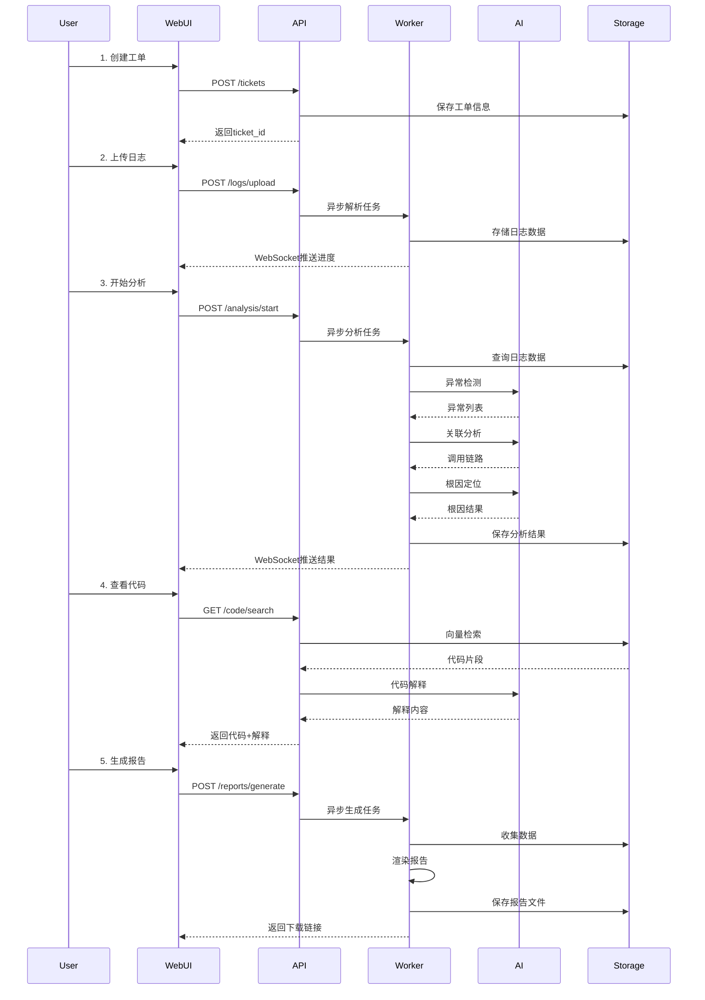
```mermaid
sequenceDiagram
    participant User
    participant WebUI
    participant API
    participant Worker
    participant AI
    participant Storage

    User->>WebUI: 1. 创建工单
    WebUI->>API: POST /tickets
    API->>Storage: 保存工单信息
    API-->>WebUI: 返回ticket_id

    User->>WebUI: 2. 上传日志
    WebUI->>API: POST /logs/upload
    API->>Worker: 异步解析任务
    Worker->>Storage: 存储日志数据
    Worker-->>WebUI: WebSocket推送进度

    User->>WebUI: 3. 开始分析
    WebUI->>API: POST /analysis/start
    API->>Worker: 异步分析任务

    Worker->>Storage: 查询日志数据
    Worker->>AI: 异常检测
    AI-->>Worker: 异常列表

    Worker->>AI: 关联分析
    AI-->>Worker: 调用链路

    Worker->>AI: 根因定位
    AI-->>Worker: 根因结果

    Worker->>Storage: 保存分析结果
    Worker-->>WebUI: WebSocket推送结果

    User->>WebUI: 4. 查看代码
    WebUI->>API: GET /code/search
    API->>Storage: 向量检索
    Storage-->>API: 代码片段
    API->>AI: 代码解释
    AI-->>API: 解释内容
    API-->>WebUI: 返回代码+解释

    User->>WebUI: 5. 生成报告
    WebUI->>API: POST /reports/generate
    API->>Worker: 异步生成任务
    Worker->>Storage: 收集数据
    Worker->>Worker: 渲染报告
    Worker->>Storage: 保存报告文件
    Worker-->>WebUI: 返回下载链接
```

---

### 4.2 SSH日志下载流程

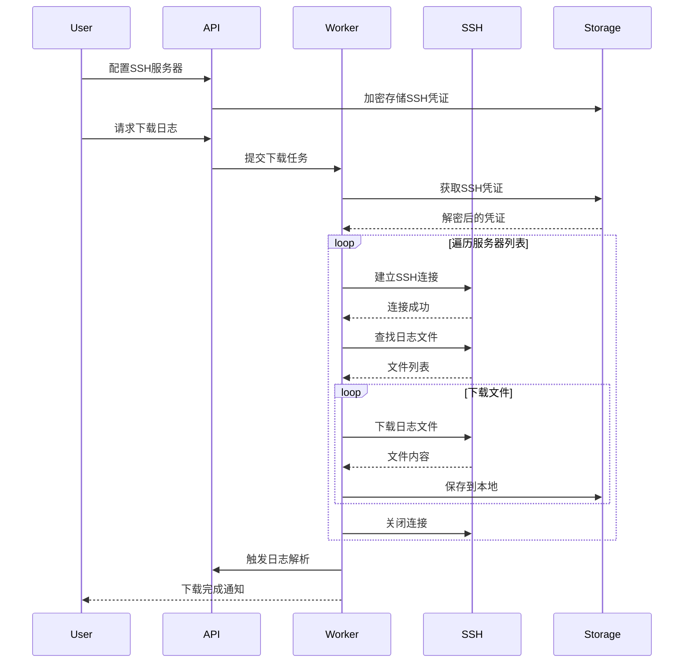
```mermaid
sequenceDiagram
    participant User
    participant API
    participant Worker
    participant SSH
    participant Storage

    User->>API: 配置SSH服务器
    API->>Storage: 加密存储SSH凭证

    User->>API: 请求下载日志
    API->>Worker: 提交下载任务

    Worker->>Storage: 获取SSH凭证
    Storage-->>Worker: 解密后的凭证

    loop 遍历服务器列表
        Worker->>SSH: 建立SSH连接
        SSH-->>Worker: 连接成功

        Worker->>SSH: 查找日志文件
        SSH-->>Worker: 文件列表

        loop 下载文件
            Worker->>SSH: 下载日志文件
            SSH-->>Worker: 文件内容
            Worker->>Storage: 保存到本地
        end

        Worker->>SSH: 关闭连接
    end

    Worker->>API: 触发日志解析
    Worker-->>User: 下载完成通知
```

---

## 5. 部署架构

### 5.1 单机部署架构

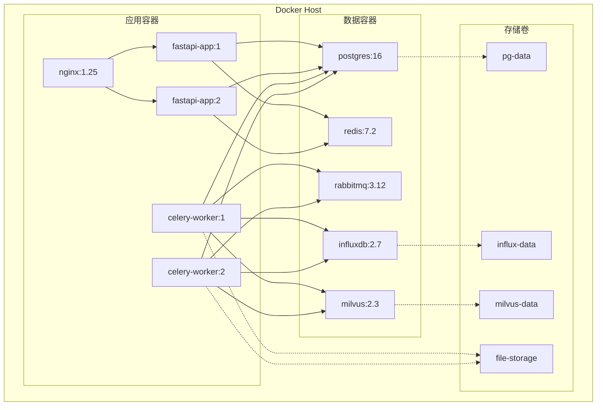
```mermaid
graph TB
    subgraph "Docker Host"
        subgraph "应用容器"
            Nginx[nginx:1.25]
            API1[fastapi-app:1]
            API2[fastapi-app:2]
            Worker1[celery-worker:1]
            Worker2[celery-worker:2]
        end

        subgraph "数据容器"
            PG[postgres:16]
            Influx[influxdb:2.7]
            Milvus[milvus:2.3]
            Redis[redis:7.2]
            RabbitMQ[rabbitmq:3.12]
        end

        subgraph "存储卷"
            PGData[pg-data]
            InfluxData[influx-data]
            MilvusData[milvus-data]
            FileData[file-storage]
        end
    end

    Nginx --> API1
    Nginx --> API2
    API1 --> PG
    API1 --> Redis
    API2 --> PG
    API2 --> Redis
    Worker1 --> RabbitMQ
    Worker2 --> RabbitMQ
    Worker1 --> PG
    Worker1 --> Influx
    Worker1 --> Milvus
    Worker2 --> PG
    Worker2 --> Influx
    Worker2 --> Milvus

    PG -.-> PGData
    Influx -.-> InfluxData
    Milvus -.-> MilvusData
    Worker1 -.-> FileData
    Worker2 -.-> FileData
```

---

### 5.2 网络架构

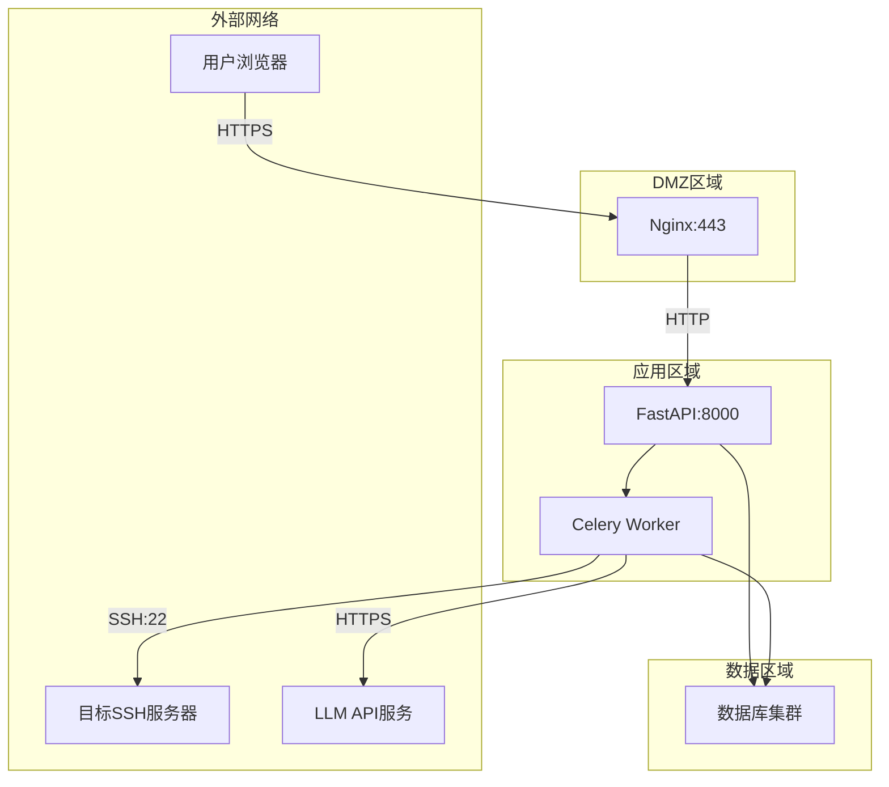
```mermaid
graph TB
    subgraph "外部网络"
        User[用户浏览器]
        TargetServers[目标SSH服务器]
        LLMService[LLM API服务]
    end

    subgraph "DMZ区域"
        Nginx[Nginx:443]
    end

    subgraph "应用区域"
        API[FastAPI:8000]
        Worker[Celery Worker]
    end

    subgraph "数据区域"
        DB[数据库集群]
    end

    User -->|HTTPS| Nginx
    Nginx -->|HTTP| API
    API --> Worker
    API --> DB
    Worker --> DB
    Worker -->|SSH:22| TargetServers
    Worker -->|HTTPS| LLMService
```

---

## 6. 安全架构

### 6.1 认证授权流程

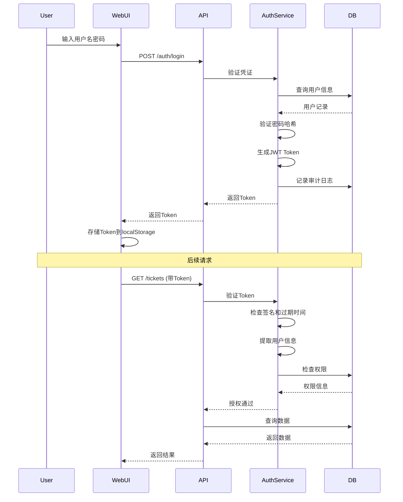
```mermaid
sequenceDiagram
    participant User
    participant WebUI
    participant API
    participant AuthService
    participant DB

    User->>WebUI: 输入用户名密码
    WebUI->>API: POST /auth/login
    API->>AuthService: 验证凭证
    AuthService->>DB: 查询用户信息
    DB-->>AuthService: 用户记录
    AuthService->>AuthService: 验证密码哈希
    AuthService->>AuthService: 生成JWT Token
    AuthService->>DB: 记录审计日志
    AuthService-->>API: 返回Token
    API-->>WebUI: 返回Token

    WebUI->>WebUI: 存储Token到localStorage

    Note over User,DB: 后续请求

    WebUI->>API: GET /tickets (带Token)
    API->>AuthService: 验证Token
    AuthService->>AuthService: 检查签名和过期时间
    AuthService->>AuthService: 提取用户信息
    AuthService->>DB: 检查权限
    DB-->>AuthService: 权限信息
    AuthService-->>API: 授权通过
    API->>DB: 查询数据
    DB-->>API: 返回数据
    API-->>WebUI: 返回结果
```

---

### 6.2 数据加密架构

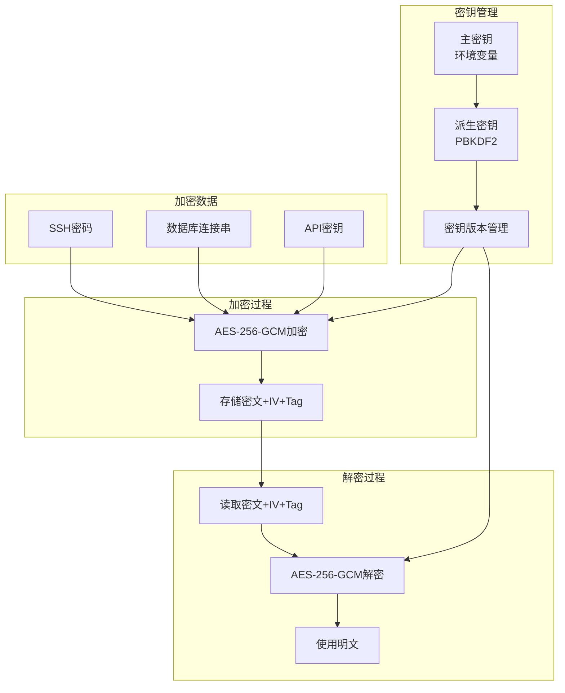
```mermaid
graph TB
    subgraph "密钥管理"
        MasterKey[主密钥<br/>环境变量]
        DerivedKey[派生密钥<br/>PBKDF2]
        KeyVersion[密钥版本管理]
    end

    subgraph "加密数据"
        SSHPass[SSH密码]
        DBConn[数据库连接串]
        APIKey[API密钥]
    end

    subgraph "加密过程"
        Encrypt[AES-256-GCM加密]
        Store[存储密文+IV+Tag]
    end

    subgraph "解密过程"
        Retrieve[读取密文+IV+Tag]
        Decrypt[AES-256-GCM解密]
        Use[使用明文]
    end

    MasterKey --> DerivedKey
    DerivedKey --> KeyVersion

    SSHPass --> Encrypt
    DBConn --> Encrypt
    APIKey --> Encrypt
    KeyVersion --> Encrypt
    Encrypt --> Store

    Store --> Retrieve
    KeyVersion --> Decrypt
    Retrieve --> Decrypt
    Decrypt --> Use
```

---

## 7. 性能优化设计

### 7.1 缓存策略

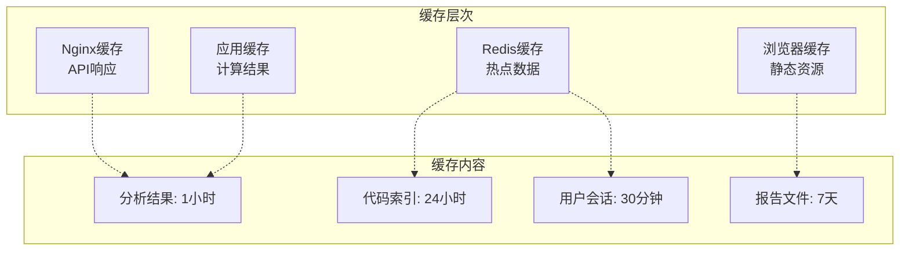
```mermaid
graph TB
    subgraph "缓存层次"
        L1[浏览器缓存<br/>静态资源]
        L2[Nginx缓存<br/>API响应]
        L3[Redis缓存<br/>热点数据]
        L4[应用缓存<br/>计算结果]
    end

    subgraph "缓存内容"
        C1[分析结果: 1小时]
        C2[代码索引: 24小时]
        C3[用户会话: 30分钟]
        C4[报告文件: 7天]
    end

    L1 -.-> C4
    L2 -.-> C1
    L3 -.-> C2
    L3 -.-> C3
    L4 -.-> C1
```

---

### 7.2 异步任务架构

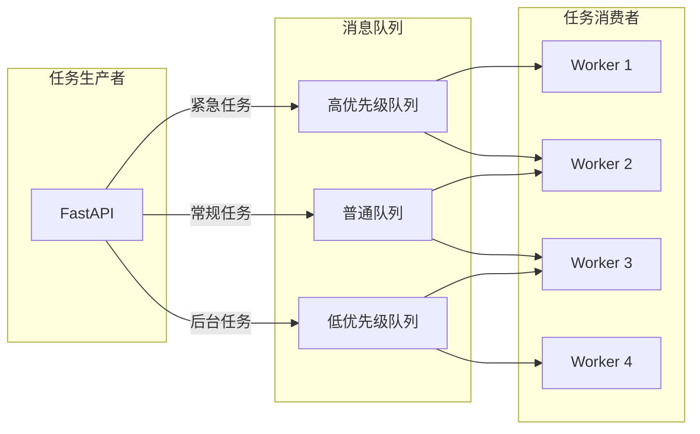
```mermaid
graph LR
    subgraph "任务生产者"
        API[FastAPI]
    end

    subgraph "消息队列"
        Queue1[高优先级队列]
        Queue2[普通队列]
        Queue3[低优先级队列]
    end

    subgraph "任务消费者"
        Worker1[Worker 1]
        Worker2[Worker 2]
        Worker3[Worker 3]
        Worker4[Worker 4]
    end

    API -->|紧急任务| Queue1
    API -->|常规任务| Queue2
    API -->|后台任务| Queue3

    Queue1 --> Worker1
    Queue1 --> Worker2
    Queue2 --> Worker2
    Queue2 --> Worker3
    Queue3 --> Worker3
    Queue3 --> Worker4
```

---

## 8. 监控与运维

### 8.1 健康检查

```mermaid
graph TB
    subgraph "健康检查端点"
        Health[/health]
        Ready[/ready]
        Live[/live]
    end

    subgraph "检查项"
        DB[数据库连接]
        Redis[Redis连接]
        Disk[磁盘空间]
        Memory[内存使用]
        Worker[Worker状态]
    end

    Health --> DB
    Health --> Redis
    Health --> Disk
    Health --> Memory

    Ready --> DB
    Ready --> Redis
    Ready --> Worker

    Live --> Memory
    Live --> Disk
```

---

### 8.2 日志架构

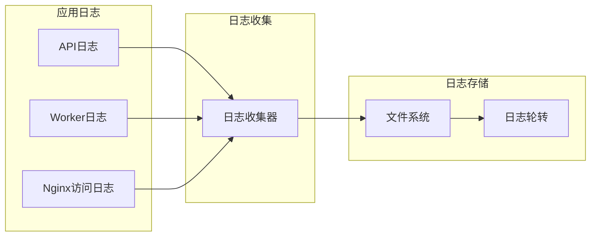
```mermaid
graph LR
    subgraph "应用日志"
        API[API日志]
        Worker[Worker日志]
        Nginx[Nginx访问日志]
    end

    subgraph "日志收集"
        Collector[日志收集器]
    end

    subgraph "日志存储"
        File[文件系统]
        Rotate[日志轮转]
    end

    API --> Collector
    Worker --> Collector
    Nginx --> Collector
    Collector --> File
    File --> Rotate
```

---

## 9. 扩展性设计

### 9.1 水平扩展能力

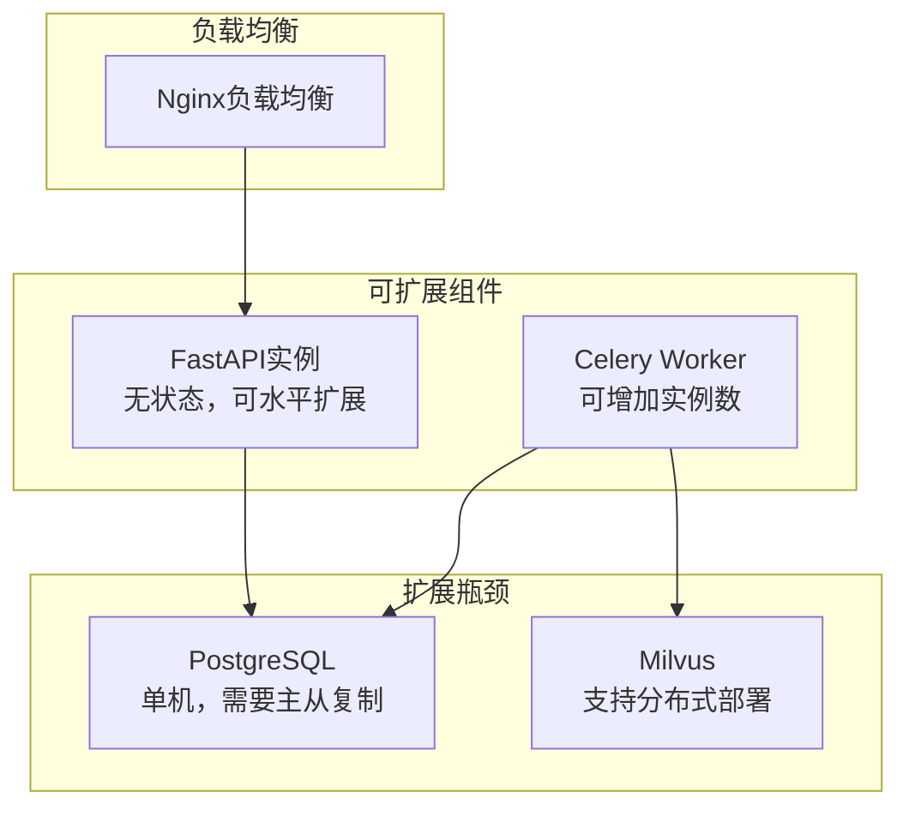
```mermaid
graph TB
    subgraph "可扩展组件"
        API[FastAPI实例<br/>无状态，可水平扩展]
        Worker[Celery Worker<br/>可增加实例数]
    end

    subgraph "扩展瓶颈"
        PG[PostgreSQL<br/>单机，需要主从复制]
        Milvus[Milvus<br/>支持分布式部署]
    end

    subgraph "负载均衡"
        LB[Nginx负载均衡]
    end

    LB --> API
    API --> PG
    Worker --> PG
    Worker --> Milvus
```

---

### 9.2 模块化设计

```mermaid
graph TB
    subgraph "核心模块"
        Core[核心框架]
    end

    subgraph "功能模块"
        M1[日志聚合模块]
        M2[日志分析模块]
        M3[代码理解模块]
        M4[报告生成模块]
        M5[权限管理模块]
    end

    subgraph "扩展模块"
        E1[知识库模块<br/>V1.1]
        E2[监控集成模块<br/>V1.2]
        E3[远程调试模块<br/>V2.0]
    end

    Core --> M1
    Core --> M2
    Core --> M3
    Core --> M4
    Core --> M5

    Core -.-> E1
    Core -.-> E2
    Core -.-> E3
```

---

## 10. 技术风险与缓解

### 10.1 单点故障风险

| 组件 | 风险 | 缓解措施 |
|------|------|----------|
| PostgreSQL | 数据库宕机导致服务不可用 | 主从复制、定期备份、快速恢复方案 |
| Redis | 缓存失效导致性能下降 | 持久化配置、主从复制、降级方案 |
| Milvus | 向量搜索不可用 | 分布式部署、备份索引、降级到关键词搜索 |
| LLM服务 | API不可用导致分析失败 | 重试机制、超时控制、降级到规则分析 |

---

### 10.2 性能瓶颈风险

| 场景 | 风险 | 缓解措施 |
|------|------|----------|
| 大文件上传 | 内存溢出 | 流式处理、分块上传、限制文件大小 |
| 并发分析 | CPU/内存不足 | 任务队列、优先级管理、资源限制 |
| 代码索引 | 索引时间过长 | 增量索引、后台任务、进度提示 |
| 向量搜索 | 查询延迟高 | 索引优化、缓存热点、分片策略 |

---

## 11. 架构演进路线

### V1.0 (当前版本)
- 单机部署
- 核心功能完整
- 支持10+并发用户

### V1.1 (第4-6周)
- 添加知识库模块
- 优化缓存策略
- 支持20+并发用户

### V1.2 (第7-9周)
- 监控集成
- 主从数据库
- 支持50+并发用户

### V2.0 (第10-12周)
- 分布式部署
- 微服务架构
- 支持100+并发用户

---

**文档结束**
