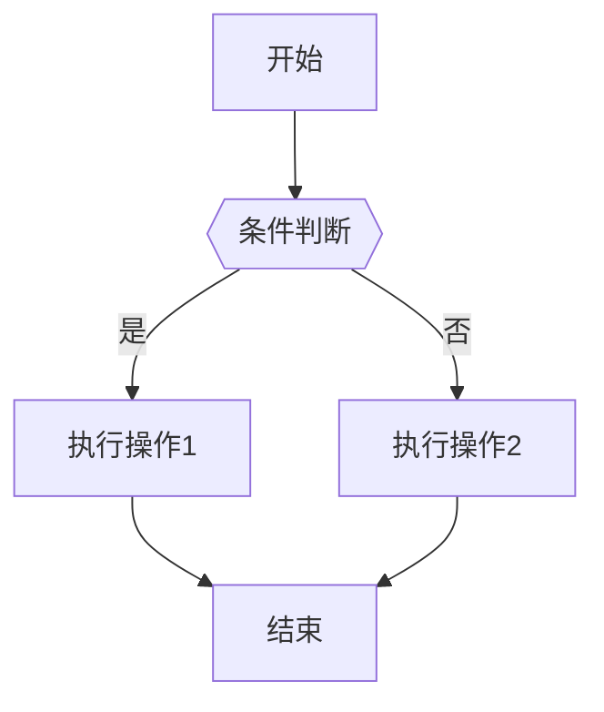

# 后端执行计划 - 模块07：代码解释模块

**模块名称**: 代码解释模块 (Code Explainer)
**优先级**: P0 - 核心功能
**依赖**: 代码索引模块
**预计工作量**: 中等
**负责人**: Backend Developer

---

## 1. 模块概述

基于代码索引提供代码搜索和AI解释功能，帮助用户快速理解代码逻辑。

### 核心功能
- 代码语义搜索（向量检索）
- 代码片段提取
- AI代码解释
- 业务流程图生成

---

## 2. 实现文件清单

### 2.1 核心服务
- `app/code_explainer/service.py` - 代码解释服务
- `app/code_explainer/searcher.py` - 代码搜索器

### 2.2 数据访问层
- `app/code_explainer/repository.py` - 代码数据访问

### 2.3 API路由
- `app/code_explainer/router.py` - API端点

---

## 3. 详细任务列表

### 任务3.1: 实现代码搜索器
**文件**: `app/code_explainer/searcher.py`

**实现内容**:
```python
from typing import List, Dict, Any
from pymilvus import Collection, connections
from app.common.config import settings
from app.code_indexer.vector_embedder import VectorEmbedder

class CodeSearcher:
    """代码搜索器"""

    def __init__(self):
        self.embedder = VectorEmbedder()
        self.collection_name = "code_vectors"

    async def search(
        self,
        query: str,
        limit: int = 10,
        filters: Dict[str, Any] = None
    ) -> List[Dict[str, Any]]:
        """
        语义搜索代码

        业务逻辑:
        1. 将查询文本向量化
        2. 在Milvus中进行向量检索
        3. 返回相似度最高的代码片段

        参数:
            query: 搜索查询（自然语言或代码片段）
            limit: 返回结果数量
            filters: 过滤条件 {language: 'java', module: 'order'}

        返回: [
            {
                id: 123,
                file_path: 'src/service/OrderService.java',
                class_name: 'OrderService',
                function_name: 'createOrder',
                code_snippet: '...',
                similarity: 0.85
            }
        ]
        """
        # 连接Milvus
        connections.connect(
            alias="default",
            host=settings.MILVUS_HOST,
            port=settings.MILVUS_PORT
        )

        # 向量化查询
        query_vector = self.embedder.embed_code(query)

        # 构建搜索表达式
        expr = self._build_filter_expr(filters) if filters else None

        # 向量检索
        collection = Collection(self.collection_name)
        search_params = {
            "metric_type": "COSINE",
            "params": {"nprobe": 10}
        }

        results = collection.search(
            data=[query_vector],
            anns_field="embedding",
            param=search_params,
            limit=limit,
            expr=expr,
            output_fields=[
                "file_path", "class_name", "function_name",
                "code_snippet", "language", "module_name"
            ]
        )

        # 格式化结果
        formatted_results = []
        for hits in results:
            for hit in hits:
                formatted_results.append({
                    "id": hit.id,
                    "file_path": hit.entity.get("file_path"),
                    "class_name": hit.entity.get("class_name"),
                    "function_name": hit.entity.get("function_name"),
                    "code_snippet": hit.entity.get("code_snippet"),
                    "language": hit.entity.get("language"),
                    "module_name": hit.entity.get("module_name"),
                    "similarity": hit.score
                })

        return formatted_results

    def _build_filter_expr(self, filters: Dict[str, Any]) -> str:
        """构建Milvus过滤表达式"""
        conditions = []
        if filters.get("language"):
            conditions.append(f'language == "{filters["language"]}"')
        if filters.get("module"):
            conditions.append(f'module_name == "{filters["module"]}"')
        return " && ".join(conditions) if conditions else None

    async def search_by_error(
        self,
        error_message: str,
        stack_trace: str
    ) -> List[Dict[str, Any]]:
        """
        根据错误信息搜索相关代码

        业务逻辑:
        1. 从堆栈信息提取文件路径和行号
        2. 提取错误关键词
        3. 组合搜索
        """
        # 提取文件路径
        import re
        file_pattern = r'at\s+[\w.]+\(([^:]+):(\d+)\)'
        matches = re.findall(file_pattern, stack_trace)

        results = []

        # 精确匹配文件
        if matches:
            file_path, line_number = matches[0]
            # 查询该文件的代码
            file_results = await self.search(
                query=error_message,
                limit=5,
                filters={"file_path": file_path}
            )
            results.extend(file_results)

        # 语义搜索
        semantic_results = await self.search(
            query=f"{error_message} {stack_trace[:200]}",
            limit=5
        )
        results.extend(semantic_results)

        # 去重
        seen = set()
        unique_results = []
        for r in results:
            key = (r["file_path"], r["function_name"])
            if key not in seen:
                seen.add(key)
                unique_results.append(r)

        return unique_results[:10]
```

**验收标准**:
- [ ] 向量检索准确
- [ ] 支持过滤条件
- [ ] 根据错误搜索代码
- [ ] 结果去重

---

### 任务3.2: 实现代码解释服务
**文件**: `app/code_explainer/service.py`

**实现内容**:
```python
from typing import Dict, Any, List
from app.code_explainer.searcher import CodeSearcher
from app.common.llm_client import LLMClient
from app.common.logger import logger

class CodeExplainerService:
    """代码解释服务"""

    def __init__(self):
        self.searcher = CodeSearcher()
        self.llm_client = LLMClient()

    async def search_code(
        self,
        query: str,
        limit: int = 10,
        language: str = None,
        module: str = None
    ) -> List[Dict[str, Any]]:
        """
        搜索代码

        参数:
            query: 搜索查询
            limit: 返回数量
            language: 语言过滤
            module: 模块过滤

        返回: 代码搜索结果列表
        """
        filters = {}
        if language:
            filters["language"] = language
        if module:
            filters["module"] = module

        results = await self.searcher.search(query, limit, filters)
        return results

    async def explain_code(
        self,
        code_snippet: str,
        language: str,
        context: Dict[str, Any] = None
    ) -> Dict[str, Any]:
        """
        解释代码片段

        业务逻辑:
        1. 调用LLM分析代码
        2. 提取函数功能、参数、返回值
        3. 识别潜在问题
        4. 生成业务流程说明

        参数:
            code_snippet: 代码片段
            language: 编程语言
            context: 上下文信息 {file_path, class_name, function_name}

        返回: {
            summary: "功能概述",
            parameters: [{name, type, description}],
            return_value: {type, description},
            logic_flow: "逻辑流程说明",
            potential_issues: ["潜在问题1"],
            business_meaning: "业务含义"
        }
        """
        # 构建prompt
        prompt = f"""请分析以下{language}代码：

```{language}
{code_snippet}
```

上下文信息：
- 文件路径: {context.get('file_path', 'N/A')}
- 类名: {context.get('class_name', 'N/A')}
- 函数名: {context.get('function_name', 'N/A')}

请以JSON格式返回分析结果：
{{
    "summary": "功能概述（一句话）",
    "parameters": [
        {{"name": "参数名", "type": "类型", "description": "说明"}}
    ],
    "return_value": {{"type": "返回类型", "description": "返回值说明"}},
    "logic_flow": "详细的逻辑流程说明",
    "potential_issues": ["潜在问题或需要注意的地方"],
    "business_meaning": "这段代码在业务上的作用"
}}"""

        messages = [{"role": "user", "content": prompt}]

        try:
            response = await self.llm_client.chat_completion(
                messages,
                temperature=0.3,
                max_tokens=1500
            )

            # 解析JSON
            import json
            explanation = json.loads(response)
            return explanation

        except json.JSONDecodeError:
            logger.error("LLM返回的不是有效JSON")
            return {
                "summary": response[:200],
                "parameters": [],
                "return_value": {"type": "unknown", "description": ""},
                "logic_flow": response,
                "potential_issues": [],
                "business_meaning": ""
            }
        except Exception as e:
            logger.error(f"代码解释失败: {str(e)}")
            raise

    async def generate_flow_diagram(
        self,
        code_snippet: str,
        language: str
    ) -> str:
        """
        生成业务流程图（Mermaid格式）

        业务逻辑:
        1. 分析代码调用关系
        2. 生成Mermaid流程图语法
        3. 返回图表定义

        返回: Mermaid图表定义字符串
        """
        prompt = f"""分析以下{language}代码，生成Mermaid流程图：

```{language}
{code_snippet}
```

请生成Mermaid flowchart语法，展示代码的执行流程。
只返回Mermaid代码，不要其他说明。

示例格式：

"""

        messages = [{"role": "user", "content": prompt}]
        response = await self.llm_client.chat_completion(
            messages,
            temperature=0.3,
            max_tokens=1000
        )

        # 提取Mermaid代码块
        import re
        mermaid_match = re.search(r'```mermaid\n(.*?)\n```', response, re.DOTALL)
        if mermaid_match:
            return mermaid_match.group(1)
        else:
            # 如果没有代码块标记，直接返回
            return response.strip()

    async def find_related_code(
        self,
        error_message: str,
        stack_trace: str
    ) -> List[Dict[str, Any]]:
        """
        根据错误信息查找相关代码

        参数:
            error_message: 错误消息
            stack_trace: 堆栈跟踪

        返回: 相关代码列表（带解释）
        """
        # 搜索相关代码
        results = await self.searcher.search_by_error(
            error_message,
            stack_trace
        )

        # 为每个结果添加简要解释
        for result in results:
            try:
                explanation = await self.explain_code(
                    result["code_snippet"],
                    result["language"],
                    {
                        "file_path": result["file_path"],
                        "class_name": result.get("class_name"),
                        "function_name": result.get("function_name")
                    }
                )
                result["explanation"] = explanation["summary"]
                result["potential_issues"] = explanation.get("potential_issues", [])
            except Exception as e:
                logger.error(f"解释代码失败: {str(e)}")
                result["explanation"] = "无法生成解释"
                result["potential_issues"] = []

        return results
```

**验收标准**:
- [ ] 代码搜索功能正常
- [ ] LLM解释准确
- [ ] 生成Mermaid流程图
- [ ] 根据错误查找代码

---

### 任务3.3: 实现API路由
**文件**: `app/code_explainer/router.py`

**实现内容**:
```python
from fastapi import APIRouter, Depends, Query
from typing import Optional, List
from app.code_explainer.service import CodeExplainerService
from app.auth.dependencies import get_current_user
from app.common.response import success_response

router = APIRouter(prefix="/api/v1/code", tags=["code"])

@router.get("/search")
async def search_code(
    query: str = Query(..., description="搜索查询"),
    limit: int = Query(10, ge=1, le=50),
    language: Optional[str] = Query(None, description="语言过滤"),
    module: Optional[str] = Query(None, description="模块过滤"),
    current_user = Depends(get_current_user),
    service: CodeExplainerService = Depends()
):
    """
    搜索代码

    支持自然语言查询和代码片段查询
    """
    results = await service.search_code(query, limit, language, module)
    return success_response(data={"results": results})

@router.post("/explain")
async def explain_code(
    code_snippet: str,
    language: str,
    file_path: Optional[str] = None,
    class_name: Optional[str] = None,
    function_name: Optional[str] = None,
    current_user = Depends(get_current_user),
    service: CodeExplainerService = Depends()
):
    """
    解释代码片段

    返回代码的功能说明、参数、返回值、逻辑流程等
    """
    context = {
        "file_path": file_path,
        "class_name": class_name,
        "function_name": function_name
    }
    explanation = await service.explain_code(code_snippet, language, context)
    return success_response(data=explanation)

@router.post("/flow-diagram")
async def generate_flow_diagram(
    code_snippet: str,
    language: str,
    current_user = Depends(get_current_user),
    service: CodeExplainerService = Depends()
):
    """
    生成业务流程图

    返回Mermaid格式的流程图定义
    """
    diagram = await service.generate_flow_diagram(code_snippet, language)
    return success_response(data={"diagram": diagram})

@router.post("/find-by-error")
async def find_code_by_error(
    error_message: str,
    stack_trace: str,
    current_user = Depends(get_current_user),
    service: CodeExplainerService = Depends()
):
    """
    根据错误信息查找相关代码

    分析错误堆栈，返回可能相关的代码片段及解释
    """
    results = await service.find_related_code(error_message, stack_trace)
    return success_response(data={"results": results})
```

**验收标准**:
- [ ] 所有端点需要认证
- [ ] 参数验证完整
- [ ] 响应格式统一
- [ ] 错误处理完整

---

## 4. 依赖模块

### 外部依赖
- pymilvus (Milvus客户端)
- 无额外依赖

### 内部依赖
- app.code_indexer.vector_embedder (向量化)
- app.common.llm_client (LLM调用)
- app.auth (认证)

---

## 5. 测试要点

### 单元测试
- [ ] 向量检索逻辑
- [ ] 过滤表达式构建
- [ ] 错误信息解析

### 集成测试
- [ ] 代码搜索完整流程
- [ ] 代码解释准确性
- [ ] 流程图生成
- [ ] 错误代码查找

### 性能测试
- [ ] 搜索响应时间<2秒
- [ ] 解释生成时间<5秒

---

## 6. 实现顺序

1. 代码搜索器 → 2. 代码解释服务 → 3. API路由

---

## 7. 完成标准

- [ ] 所有任务完成
- [ ] 搜索准确率>80%
- [ ] 解释清晰易懂
- [ ] 测试通过

---

**文档结束**
